# LMS42

## Свободная образовательная система

[LMS42](http://lms42.com) — свободная открытая образовательная система, предназначенная для поддержки школьного и ВУЗовского образования. Она может использоваться и для организации дистанционного обучения.

**Основные задачи, которые решает система:**

1. Предоставить удобный инструмент работы для учителей и учеников, позволяющий перенести большую часть материала в Интернет.
2. Не ограничивать возможность учащегося получать знания исключительно в здании школы.
3. Вовлечь ученика в образовательный процесс, используя понятные ребёнку инструменты.
4. Использовать все возможности, предоставляемые Интернетом, для улучшения стандартных педагогических практик.
5. Сконцентрировать урок на получении новой информации и навыков, а не способах её записи в тетрадь. 
6. Дать возможность учащимся повторить пройденный материал в любое время в любом месте.
7. Реализовать простую схему **самостоятельного изучения** материалов урока для тех учеников, которые пропустили занятие по каким-либо причинам (например, из-за болезни).

> LMS42 — действительно удобный инструмент. С его помощью и учитель, и ученик смогут **сэкономить время**. Никаких больше тетрадей и конспектов! Воспользуйтесь преимуществами онлайна!

### Ключевые возможности системы

* Работа ведётся в рамках курсов — групп уроков, объединённых общей темой. К примеру, в рамках предмета "Математика" могут быть курсы: *Квадратные уравнения*, *Неравенства* и др. Учитель может создавать и впоследствии редактировать неограниченное число курсов. Учащийся может записаться на курс.
* Единица образовательной деятельности в рамках LMS42 — урок. Именно из уроков состоит курс. Последовательное прохождение уроков делает возможным закончить курс. Каждый урок состоит из ряда следующих компонент:
    1. Презентация. LMS42 интегрирован с сервисом [SlideShare](http://slideshare.net), поэтому для публикации новой презентации достаточно закачать в этот сервис и добавить ссылку в урок.
    2. Текстово-графические материалы. Это — теоретические пособия для урока. Они содержат основной теоретический материал, не представленный в презентации или представленный в ней сжато. Один урок может содержать несколько материалов, разбитых по темам. Помимо текста материал может содержать рисунки и формулы.
    3. Полезные ссылки. Вместо копирования информации, к примеру, с [Википедии](http://ru.wikipedia.org), можно просто-напросто проставить ссылку. Учащийся, заинтересованный в дополнительном материале, видит список прикреплённых ссылок. Каждый урок может содержать неограниченное число ссылок.
    4. Вопросы и ответы. В рамках системы учащиеся могут задавать вопросы учителю через специальный интерфейс *Задать вопрос*. Ответы учителя прикрепляются в уроку, и будущие ученики перед тем, как задать свой вопрос, могут ознакомиться с уже существующими.
    5. Задания. Ключевой аспект урока — список заданий, которые необходимо выполнить для успешного завершения урока. Учитель к каждому уроку создаёт несколько заданий (обычно: 2-4 задания). Каждое задание предполагает развёрнутый ответ (подробнее [см. ниже](tasks)). За каждое задание учителем выставляется оценка.
    6. Тесты. В целях самоконтроля учащихся к уроку может быть прикреплён любой из существующих тестов.
* Тесты и контрольные работы. Несмотря на то, что и тесты, и контрольные работы технически являются идентичными, они выполняют разную функцию:
    * Тесты помогают ученику адекватно оценить уровень своих знаний после прохождения урока. Количество повторных прохождений тестов неограничено, ученик может проходить их дома, в школе, в любом месте, где есть Интернет. Таким образом, тест — элемент самоконтроля со стороны учащегося.
    * Контрольная работа создаётся и назначается учителем в определённое время. Учащиеся до начала работы не имеют доступа к ней и к вопросам, в неё включённым. Таким образом, контрольная работа — элемент контроля и проверки усвояемости со стороны учителя.

### Схема обычной работы с системой

Ежедневную работу в системе можно представлять в виде следующих шагов:

1. Учитель рассказывает новый материал и разбирает примеры.
2. Ученики начинают новый урок в рамках системы.
3. Придя домой, учащийся просматривает ещё раз презентацию по уроку и текстовые материалы.
4. Затем учащийся выполняет предложенные на урок занятия и отправляет их учителю.
5. Учитель просматривает в административной панели список выполненных заданий и оценивает их. Если решение ученика не нравится учителю, то задание отклоняется и отправляется на доработку ученику. В этом случае задание не засчитывается и оценка не выставляется до повторной отправки учеником задания. Этот механизм позволяет дорабатывать задания до полного их понимания.
6. Ученик видит полученные оценки за задания и выполняет тест к уроку для самопроверки. Если его устраивают результаты, то он заканчивает урок. Если нет — повторяет ещё раз материал и перепроходит тест.

### Как начать работу?    
LMS42 — свободное программное обеспечение, распространяемое по открытой лицензии MIT. Любой желающий имеет право использовать его как в некоммерческих, так и в коммерческих целях. Подробная схема установки описана на [официальном сайте](http://lms42.com) проект и в [репозитории github](http://https://github.com/lms42/lms42).

Если вам нужна помощь в установке и/или настройке проекта, вы всегда можете обратиться непосредственно к авторам (их контакты указаны на [официальном сайте](http://lms42.com)), либо в [Google+ сообщество пользователей LMS42](https://plus.google.com/communities/115509331188973679018).

# Работа с системой

Перед тем, как начать работу, убедитесь, что вам известны следующие данные:

1. Адрес веб-сайта, где расположена копия системы.
2. Вам известен ваш логин и пароль (для администраторов: логин и пароль должны быть административными).

Раздел документации "Интерфейс ученика" предназначен для учащихся, "Интерфейс учителя" — для учителей и администраторов системы.

> **Важно:** в документации используются скриншоты, взятые с демо-версии продукта. Содержимое страниц может немного отличаться в зависимости от тех данные, которые занёс администратор системы. 

#### Вход в систему

Для входа в систему воспользуйтесь ссылкой "Вход", расположенной в верхней части экрана. В появившемся всплывающем окне введите свой логин (**не e-mail, а логин**) и пароль и нажмите кнопку "Вход".

----

# Интерфейс ученика

После успешного входа ученик попадает на *Панель управления*.

## Панель управления

Панель управления — специальную страницу, аккумулирующую основную информацию об участии пользователя в системе. Эта страница состоит из нескольких частей:

1. Панель навигации. 
    * Панель управления. Главная страница учащегося.
    * Новости. Текстово-графический раздел с Новостями и/или другими материалами.
    * Результаты. Представляет собой выпадающих список с тремя ссылками:
        * Результаты курсов. Показывает ваши текущие успехи в обучении.
        * Результаты тестов. Показывает ваши текущие успехи в прохождении всех тестов внутри системы.
        * Контрольные работы. Показывает ваши успехи в контрольных работах по всем курсам, которые вы проходили.
    * Курсы. Содержит несколько ссылок:
        * Список всех курсов, на которые вы записаны. По одной ссылке на каждый курс. Нажав на ссылку, вы перейдёте на страницу данного курса.
        * Все курсы. Перейдя по этой странице, вы попадёте на страницу всех курсов (подробное описание доступно ниже).
    * Тесты. Содержит список тестов, которые можно пройти прямо сейчас для повторения материала + результаты нескольких последних тестов.
    * **Текущий тест**. Этот пункт появляется только в случае, если вы прямо сейчас выполняете тест. Этот пункт — быстрая ссылка к проходимому тесту, если вдруг вы ушли со страницы выполнения теста.
    ** Ваша фамилия и имя. Представляет собой выпадающий список со ссылкой на ваш личный профиль.
2. Вкладки:
    * Ваши уроки и задания: содержит список текущих уроков и заданий, которые необходимо выполнить. Если задание отклонено — оно отмечается специальным красным бейджем. Показываются только те задания, которые ещё не засчитаны. Ваша цель — сделать так, чтобы по этой вкладке была видна следующая картина:
     Запись "Все уроки выполнены" появляется только в том случае, если вы закончили все задания к активным урокам по всем курсам.
    * Законченные задания. Этот блок появляется только в том случае, если у вас есть хотя бы одно законченное задание. В этом блоке вы можете посмотреть оценки за последние выполненные задания. Зелёным подсвечиваются задания с оценкой "Отлично", красным — с оценкой ниже тройки.
    * Тесты. Содержит результаты пяти последних выполненных тестов.
3. Название урока, который ещё не выполнен. Позволяет быстро перейти в интерфейс урока.
4. Список недоделанных заданий. Позволяет быстро перейти к уроку, в котором есть это задание и начать его выполнять.
5. Ваш прогресс по выполнению курса или "сколько осталось в граммах".
6. Новости и ссылки на блог проекта.

> **Основная цель панели управления**: дать возможность быстро оценить текущее состояние дел и быстро в один клик приступить к выполнению заданий.

## Страница "Все курсы"

Нажав в верхней панели "Курсы -> Все курсы" попадёте на страницу со списком всех курсов. 
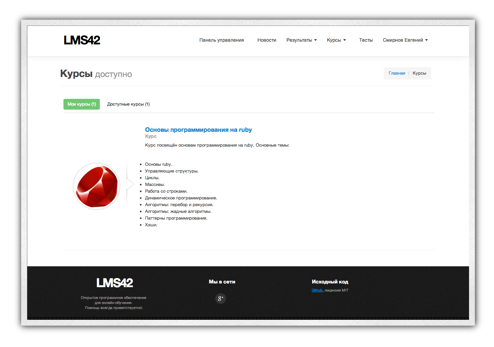
Эта страница разделена на две части с помощью панели табов:
* Мои курсы. Этот таб по умолчанию активен. В этом случае показывается список тех курсов, **на которые вы уже записаны**. Нажав на название курса, вы попадёте на страницу курса.
* Доступные курсы. Этот таб содержит список курсов, которые вы ещё не проходили. Нажав на название доступного курса вы попадёте на страницу этого курса и сможете записаться на его прохождение. **Это — единственный способ**, как можно записаться на новый курс. Именно так вы будете записаться в первый раз на свой первый курс.

### Запись на курс

Допустим, во время первого урока учитель вам сказал, что курс, который вы проходите, называется *Информация* и попросил записаться на него. Для записи вы выполняете следующие шаги:

1. Заходите на сайт и логинитесь.
2. В верхней навигационной панели выбираете "Курсы -> Все курсы".
3. Нажимаете на таб "Доступные курсы".
4. Ищете среди доступных курсов курс "Информация".
5. Нажимаете на название курса.
6. Нажимаете на кнопку "Записаться на курс".
7. Переходите к первому уроку, доступному в курсе.

## Страница отдельного курса

Когда вы перешли на страницу отдельного курса, возможны два варианта:

1. Вы ещё не записаны на этот курс. Тогда вы увидете что-то похожее на . Большая кнопка "Записаться на курс" позволит вам начать выполнение уроков этого курса.
2. Вы уже проходите данный курс. Тогда вы увидите  Обратите внимание, что вы можете сделать на этой странице:
    * Повторить любой пройденный урок. Для этого достаточно нажать на кпноку "Повторить" напротив любого пройденного урока.
    * Продолжить выполнение текущего урока.
    * Перейти к уроку, который вы ещё даже не начинали. Эта функция полезна в том случае, если вы хотите хорошо подготовиться к уроку и прочитать материал заранее (полезная вещь, кстати).
    * Удалиться с курса. Если вы по ошибке записались не на тот курс, — не проблема. Нажмите кнопку "Удалиться с курса", и вся информация о вашем участии в этом курсе будет удалена. **Обратите внимание**: удалена означает удалена. То есть, если вы прошли 5 уроков, а затем по ошибке нажали кнопку "Удалиться с курса", то **вся информация, включая пройденные уроки**, будет удалена. То есть, вам придётся заново начинать прохождение курса. Используйте эту кнопку с умом.
    
## Страница урока

Страница урока разделена на две составные части: меню (слева) и контентную область (справа). Если вы хотите вернуться на страницу курса и выбрать другой урок, воспользуйтесь панелью "хлебных крошек" в верхней части страницы. Название курса, которому принадлежит текущий урок, является гиперссылкой на страницу просмотра курса.

 В каждом уроке могут присутствовать следующие компоненты:

1. Основной текст. Ссылка для возврата к основной презентации.
2. Список текстово-графических материалов. Каждый материал имеет собственное название, отображаемое в левом меню.
3. Вопросы и ответы. Список вопросов, которые другие ученики задавали по этому уроку. Перед тем, как спросить что-то учителя, всегда нужно заглядывать в этот раздел. Возможно, ответ на ваш вопрос уже есть.
4. Задать вопрос. Если ответа на ваш вопрос нет в разделе "Вопросы и ответы" — нажмите на ссылку "Задать вопрос" и запишите свой вопрос. Старайтесь писать грамотно и понятно: ответ на ваш вопрос может пригодиться будущим поколениям.
5. Тесты. Какие тесты прикреплены к уроку. Именно с этой страницы можно начать их выполнение.
6. Задания (список): список заданий, прикреплённый к текущему уроку. Задание может находиться в следующих состояниях:
    * В работе. Означает, что вы его либо не начали выполнять, либо пока ещё не выполнили.
    * На проверке. Вы отправили ответ на задание учителю, но тот ещё не проверил. Для таких заданий рядом с названием появляется иконка часов.
    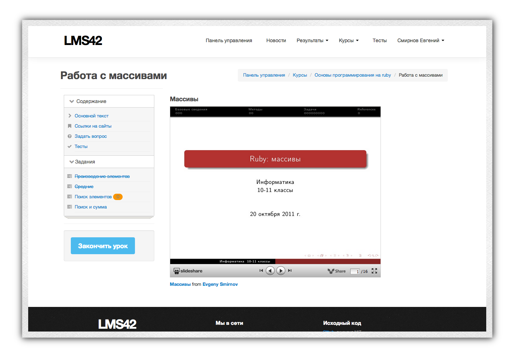
    * Выполнено. Учитель засчитал вам задание и поставил оценку. Чтобы увидеть оценку, просто перейдите по ссылке с названием задания. Выполненные задания перечёркиваются, чтобы вам было их увидеть.
    * Отклонено. Учитель посмотрел ваше решение, но оно ему не понравилось. Рядом с отклонёнными заданиями добавляется красный бейдж с восклицательным знаком.  Перейдите по ссылке на отклонённое задание — и справа вы увидете рецензию:
    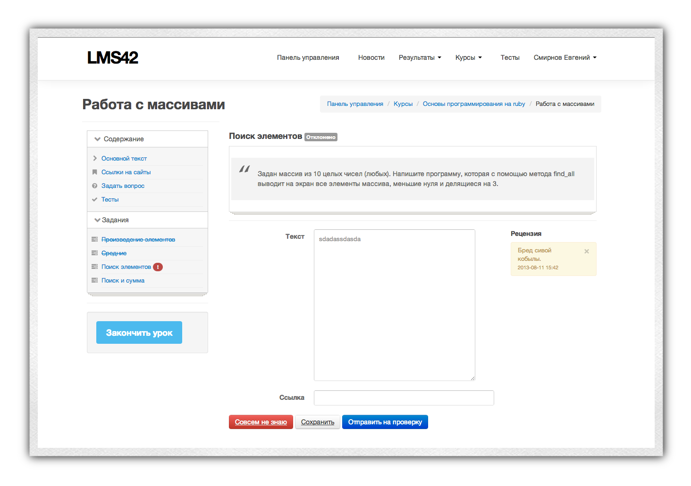
    Отклонённое задание необходимо исправить и повторно отправить на проверку. Процесс повторяется до полного принятия задания.
    * Провалено. Если вы уверены, что не сможете выполнить задание качественно, вы можете воспользоваться нажать на кнопку "Совсем не знаю" в интерфейсе задание (см. скриншот выше). В этом случае задание автоматически засчитывается, но с минимальной оценкой.
    
### Процесс работы

1. Записавшись на курс, вы получаете возможность проходить уроки. Для начала своего первого урока перейдти на страницу урока со страницы курса.
2. Если вы сделали всё правильно (записались на курс и перешли к первому непройденному уроку), то слева внизу вы увидете кнопку "Начать урок"  Нажав на неё, вы начнёте урок.  
> Важный момент: все уроки проходятся последовательно. Иными словам, вы не сможете начать второй урок, минуя первый. Кнопка "Начать урок" появляется только у тех уроков, которые вы **действительно можете** начать.
3. После того, как вы просмотрите всю необходимую информацию, вы можете закончить урок. Кнопка окончания располагается там же, где и кнопка начала. Закончить урок означает, что вы **ознакомись** со всеми материалами урока и всё поняли.
4. После этого вам необходимо выполнить все задания и тесты. Только после того, как все задания будут зачтены, а все тесты — пройдены, у вас появится возможность завершить урок (кнопка "Завершить урок). Завершение одного урока открывает вам доступ к следующему.

## Тесты и контрольные работы

Схема работы с тестами и контрольными работами полностью идентична. Тесты выполняются либо с общей страницы тестов (ссылка в навигационной панели сверху), либо из интерфейса урока. Контрольные работы назначаются исключительно учителем и появляются в навигационной панели сверху с подписью "Текущий тест".

Начав прохождение теста, вам предложат просмотреть описание теста
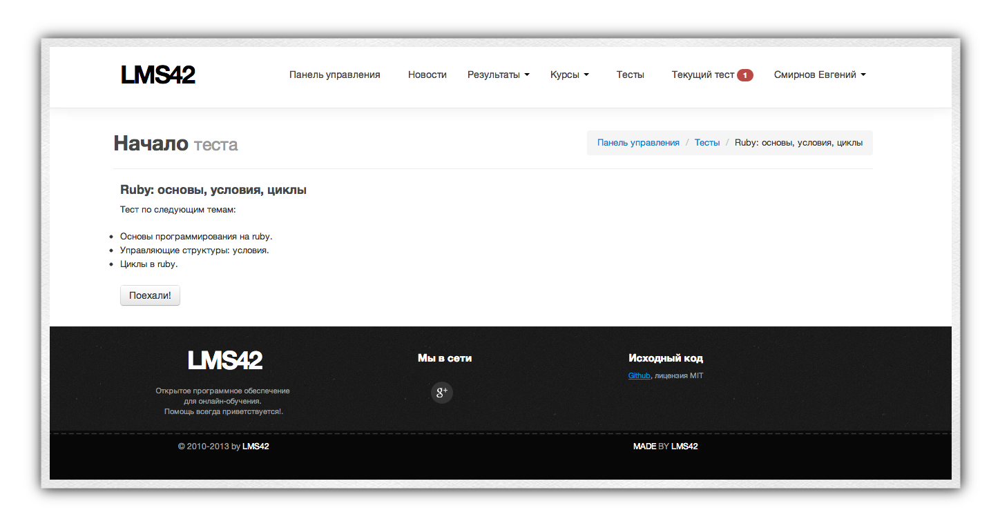
Нажмите на кнопку "Поехали" для начала теста.

Тесты бывают двух видов:

* с ограничением по времени. В этом случае после окончания отведённого времени тест автоматически завершается, а любые ответы после этого не засчитываются.
* без ограничения по времени.

Вопросы также бывают нескольких типов:

* с вариантами ответа. В этом случае вам достаточно выбрать правильный ответ из предложенных 
* без вариантов ответа (ответ в виде текста). В этом случае ответ вы должны вписать самостоятельно. 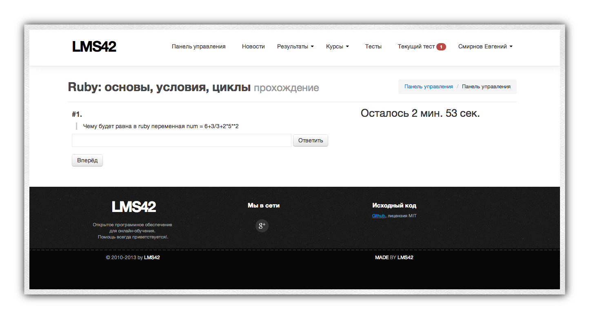

> **Обратите внимание!** Если вы вводите вручную правильный ответ, то в вашем ответе не должно быть грамматических ошибок. Равно как ответ должен подчиняться нормам и правилам русского языка, а также быть точным. Неточный и/или неграмотный ответ не засчитывается, даже если решение — правильное.

В любой момент прохождения теста вы можете с помощью кнопок "Назад" и "Вперёд" вернуться к более раннему вопросу и ввести иной ответ. 

В конце по нажатию кнопки "Завершить тест" или по окончанию времени, отведённого на тест, вам будет показана страница с результатами, а также список вопросов, на которые был дан неправильный ответ. Ответы не публикуются.

Результаты всех тестов и контрольных работ сохраняются и доступны в соответствующих пунктах верхнего меню навигации.

## Заключение

Несмотря на данное руководство, у вас будет множество вопросов. Их большая часть решится сама собой, когда вы попробуете систему в действии. По другим вопросам вы можете обращаться как к своему учителю, так и в [официальное сообщество LMS42](https://plus.google.com/communities/115509331188973679018). Успехов в учёбе!

------

# Интерфейс учителя

Для того, чтобы попасть в интерфейс учителя, вам необходимо зайти под административным (учительским) логином. После успешного входа в навигационной панели в выпадающем меню под вашим именем появится пункт "Администрирование":
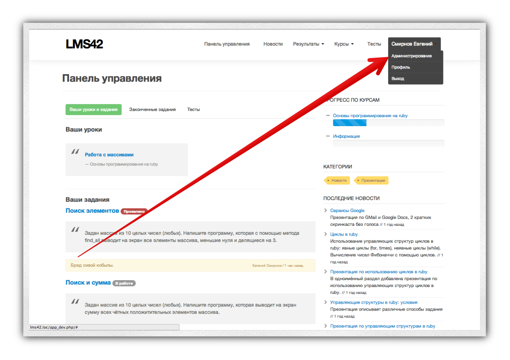

> Несмотря на то, что LMS42 работает во всех популярных браузерах, в целях совместимости рекомендуется использовать браузер Google Chrome последней версии.

## Общие принципы

Несмотря на огромное количество пунктов в административной панели, принципы управления сохраняются везде одними и теми же.

Прежде всего, следует понять, что существует четыре основных действия:

* просмотреть,
* создать,
* изменить,
* удалить.

Практически каждую сущность в LMS42 (курс, урок, задание, ученик, группа и пр.) можно изменить, удалить или добавлять ещё один экземпляр. 

Одинаковые по структуре сущности представляются в виде таблиц (действие **просмотр**). Например, таблица учеников содержит id (уникальный номер в системе), логин, e-mail, настоящее имя, группы, а также четыре действия: включить / выключить (бан), статистика по ученику, изменить и удалить. Другие сущности могут содержать другие поля и действия, но принцип остаётся всегда единым.

### Просмотр

Рассмотрим внимательно стандартный вид таблицы (пункты соответствуют цифрам на картинке):

1. Общая панели навигации для административной панели. Содержит ссылки на все разделы.
2. Название текущей страницы.
3. Панель сортировки. Если заголовок столбца выделен синим цветом (цветом ссылки), это означает, что можно отсортировать таблицу по заданному параметру. Например, таблицу с пользователями можно отсортировать по имени ученика (по алфавиту, разумеется). 
4. Панель фильтров (подробно о фильтрации написано ниже).
5. Кнопка "Фильтровать". Применяет фильтры к таблице.
6. Создать новой записи (например, пользователя, урока, курса и пр.).
7. Знаки "Плюс" и "Минус" соответствуют действиям "Опубликовать" (плюс), "Скрыть" (минус). К примеру, вы создаёте новую запись в блоге и сохраняете её для того, чтобы доработать дома. Если запись будет опубликована, то её смогут увидеть все. Но если она скрыта, то её будете видеть только вы в административной панели. Аналогия с Черновиками.
8. Кнопки "Изменить" и "Удалить" в каждой строке. Позволяют изменять и удалять сущности.

### Фильтрация

Вы можете отфильтровать таблицу по любым наперёд заданным критериям. Для этого в поля фильтров введите соответствующие значения и нажмите кнопку "Фильтровать" справа вверху. 

#### До фильтрации
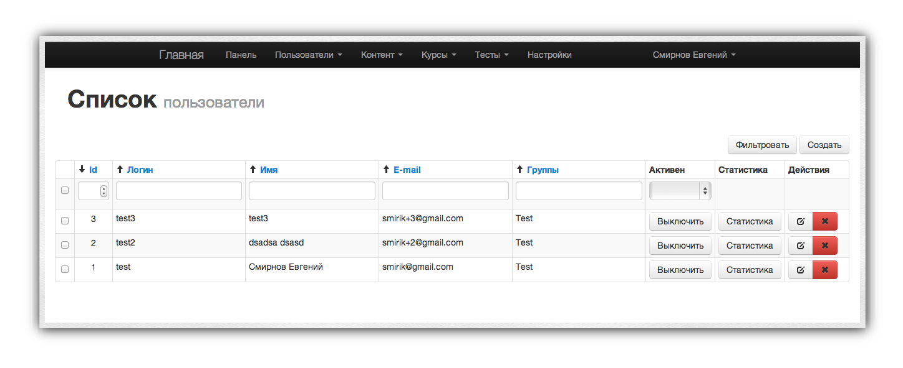

#### После фильтрации

> **Обратите внимание**: допускается фильтровать сразу по нескольким полям (например, по имени и e-mail'у).

> **Не забывайте** нажимать кнопку "Фильтровать", когда вы хотите применить фильтры к таблице. Пока кнопка не нажата — фильтрация не сработает.

> **Обратите внимание**: можно одновременно и фильтровать, и сортировать. Можно фильтровать в несколько шагов. К примеру, ввёл имя — отфильтровал, добавил фильтр по e-mail — отфильтровал.

## Пользователи и группы

Все ученики и учителя являются пользователями системы. Только пользователи системы могут участвовать в работе. Каждый пользователь имеет:

* логин (уникальный идентификатор. Состоит из латинских символов, без пробелов и спецсимволов),
* пароль,
* e-mail,
* дату регистрации,
* группы.

Администратор имеет возможность сбросить пароль любому пользователю (включая самого себя). Допустим, мы хотим сбросить пароль пользователю test2. Для этого необходимо: 

* нажать на кнопку "Изменить" напротив test2: 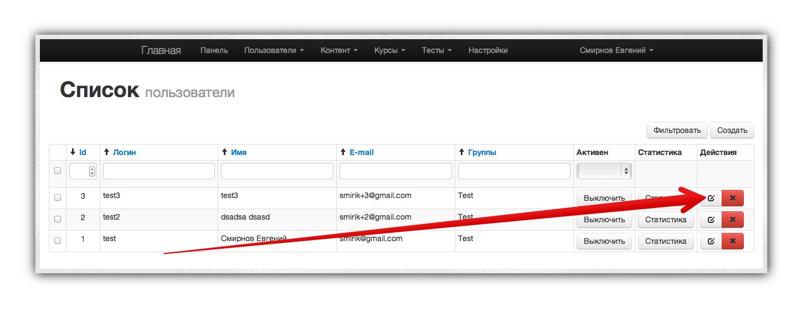
* ввести новый пароль в форме редактирования: 
* нажать кнопку "Сохранить".

> **Обратите внимание:** есть две кнопки — "Сохранить" и "Сохранить и вернуться". Нажимая первую кнопку, вы сохраняете и переходите к просмотру таблицы. Нажимая "Сохранить и вернуться" после сохранения вы возвращаетсь опять к редактированию.

### Бан

Напротив каждого пользователя есть кнопки "Включить" и "Выключить". Выключенные пользователя не имеют право логиниться в системе (аналогия бана).

### Группы

Учеников полезно объединять в группы. Для того, чтобы присоединить ученика к уже существующей группе, необходимо войти в режим редактирования (кнопка "Изменить" в таблице напротив нужного ученика, как в изменении пароля выше) и выделить в пункте "Группы" те, к которым вы хотите присоединить ученика. Обратите внимание, что один ученик может находиться в нескольких группах.

У группы есть ровно один атрибут — название.

#### Примеры полезных идей для групп
* Объединять учеников одного класса в группы.
* Объединять учеников одной группы внутри класса в группу по группе и в группу по классу (к примеру, 11а первая, 11а вторая, 11а целиком)

#### Зачем нужны группы?

Группы позволяют проводить массовые операции над учениками. К примеру, в разделе "Группы" вы можете просмотреть сводную статистику по ученикам какой-либо группы. Смотреть статистику по каждому ученику отдельно было бы гораздо менее удобно.

По группам можно вести фильтрацию. К примеру, когда вы будете создавать контрольные работы, вам надо будет назначать учеников на эти работы. Фильтрация по группе позволит вам это сделать легко и непринуждённо.

#### Список групп

В выпадающем меню выберите "Пользователи -> Группы"
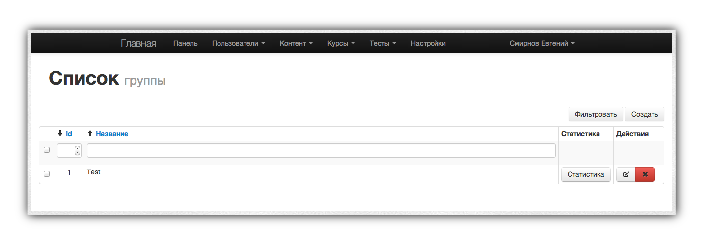

## Контент и категории контента

Категории и контент (статьи) позволяют вам публиковать материалы без привязки к конкретному курсу. Например, публиковать новости и/или объявления для всех учеников. Категории созданы для группировки контента.

### Категории
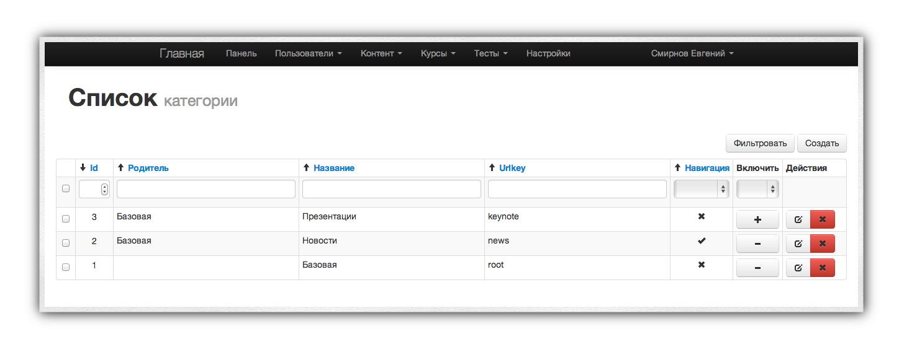

Категории представляют собой простой список. Каждая категория может иметь *родителя* — материнскую категорию (тем самым, являясь как бы подкатегорией). Также у категории есть:

* название, 
* urlkey — специальное слово на английском языке без пробелов, которое появляется в URL. К примеру, http://demo.lms42.com/categories/news : news — это и есть urlkey.
* Навигация. Вы могли заметить, что, к примеру, категория "Новость" по умолчанию находится в навигации у ученика. Это потому что параметр "Навигация" отмечен у этой категории. Вы можете отметить этот параметр и у других категорий, если хотите поместить их тоже в верхнюю навигацию. Для этого нажмите кнопку "Изменить" напротив нужной категории и поставьте галочку в пункте "Навигация" 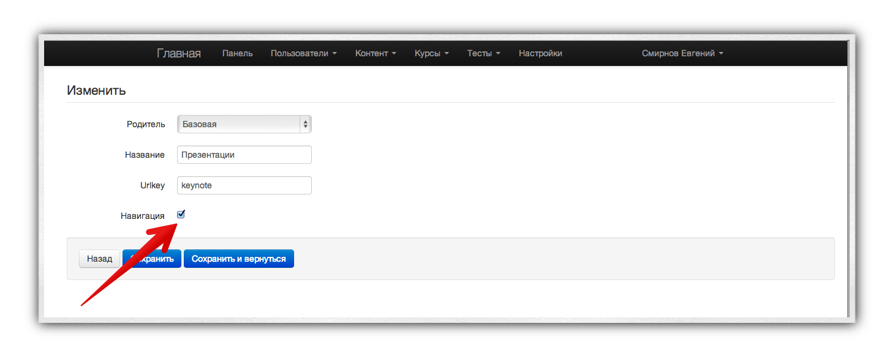
* включить / выключить: позволяет деактивировать на время категорию и не показывать её ученикам.

### Контент

Контент — это полная аналогия статье и/или записи в блоге. У статьи есть следующие атрибуты:

* название,
* описание (в сжатом виде, отображается на странице категории),
* текст (собственно, само содержимое),
* файл (основная картинка статьи, поле необязательно к заполнению),
* urlkey (см. выше, необязательно к заполнению),
* активен (включать / выключить статью),
* weight (вес) — сортировка статей внутри категории (ныне не используемое).

#### Редактор WYSIWYG

LMS42 использует [WYSIWYG-редактор](http://ru.wikipedia.org/wiki/WYSIWYG) [CKEditor](http://ckeditor.com/) для редактирования текста. Он позволяет выделять текст полужирным / курсивным начертанием, менять цвета и форматирование текста, проставлять гиперссылки, а также вставлять изображения.

Для вставки изображения с компьютера выполните следующие действия:

1. Нажмите на кнопку "Закачать изображение" 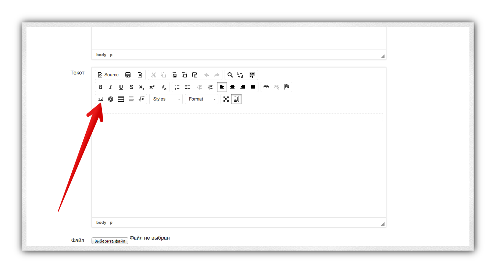 
2. Если вы уже закачивали эту картинку ранее, выберите пункт "Browse server". Если нет — то вкладку Upload.  
3. Если вы закачиваете новый файл, нажмите кнопку "Выбрать файл" и выберите нужный. После этого нажмите на кнопку Sent it to Server. После выполнения этого нажмите кнопку OK.  
4. Закачанное изображение появится в самом редакторе. Если вы захотите его удалить — просто используйте стандартную процедуру (кнопка Backspace / Delete).

> Помните: любой новый контент всегда отображается в Панели управления ученика. Используйте этот инструмент, когда вам надо оперативно донести до всех какую-то важную информацию.

## Курсы и уроки

Курсы и уроки составляют основу системы.

### Курсы

Курс представляет собой группу уроков, объединённую общей темой. Создавайте курсы по темам в вашем планировании. Например, "Средние века" для истории, "Генетика" для биологии, "Квадратные уравнения" для математики и пр.

Курс содержит:

* название,
* описание (используется на странице курса у ученика),
* тип (последовательно, в любом порядке): должен ли ученик мочь смотреть уроки, которые он ещё не проходил,
* файл — изображение для курса. Оно появляется у ученика на странице всех курсов.
* открытый — любой имеет право просматривать курс,
* активен — включить/выключить курс.

Форма редактирования курса повторяет ранее показанные примеры.

### Уроки

Урок является единицей системы. Форма создания / изменения урока поистинне самая сложная в проекте.

#### Список

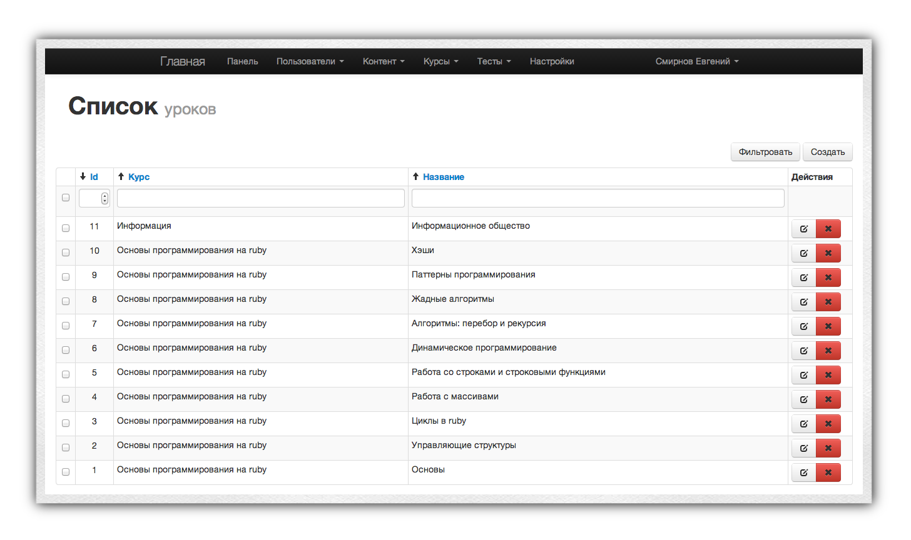

Таблица с уроками содержит три основных столбца: идентификатор, курс, к которому принадлежит урок и название урока. Вы можете фильтровать и сортировать по любому из этих полей. Например, если вы хотите найти все уроки курса "Основы программирования на ruby", вы можете ввести в фильтр этого столбца "программирование на ruby" и нажать кнопку "Фильтровать". В этом случае только удовлетворяющие фильтру уроки будут показаны в таблице.

#### Создание нового урока

1. Нажмите кнопку "Создать" в интерфейсе таблицы урока справа вверху.
2. Форма создания урока содержит несколько основных вкладок: 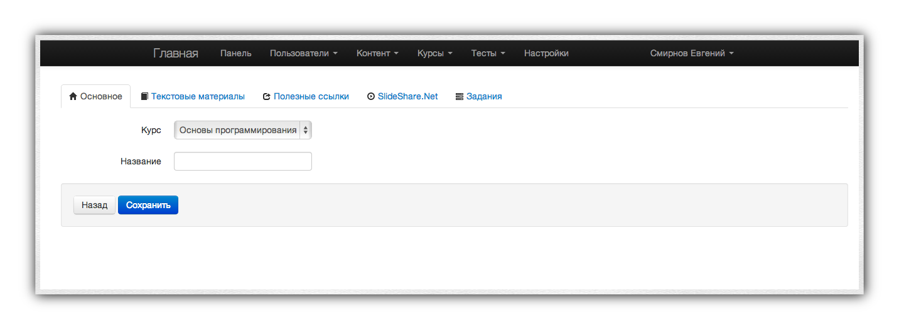
    * Основное. Здесь вы задаёте курс, в который вы добавляете урок, и название урока.
    * Текстовые материалы. Здесь вы можете добавить тексты, формулы, изображения к данному уроку.
    * Полезные ссылки. Гиперссылки с полезными материалами.
    * Slideshare.net. Ссылки на презентации, расположенные в сервисе [Slideshare.net](http://slideshare.net).
    * Задания. Задания для учеников к этому уроку.
3. Добавим текст. Для этого перейдём во вкладку "Текстовые материалы" и нажмём там кнопку "Добавить" 
4. Появилась форма, содержащая три поля: название материала, краткое описание и текст. Два последних поля содержат WYSIWYG-редактор, а это значит, что вы можете добавлять туда любые изображения через закачку картинок. Если вы хотите добавить ещё один материал в этот урок, кнопка "Добавить" всё ещё осталась внизу. Если вдруг материал вам больше не нужен, нажмите кнопку "Удалить" напротив соответствующего материала. 
5. Полезные ссылки и презентации со slideshare добавляются абсолютно аналогично. Обратите внимание, что для slideshare обязательно в поле "Ссылка" указать ссылку на презентацию. К примеру, http://www.slideshare.net/smirik/ruby-11601320 . Вы не обязаны добавлять в урок sildeshare-презентацию.
6. В конце, после того, как вы добавили и тексты, и ссылки, и задания, нажмите на кнопку "Сохранить" или "Сохранить и вернуться" в самом низу страницы. **Не забудьте нажать эту кнопку** — иначе все изменения потеряются! Пока вы не нажали кнопку — изменения не применяются. Даже если вы, к примеру, удалили один текст — пока не нажата кнопка "Сохранить", удаление на завершится.

#### Редактирование существующего урока

В целом, процесс редактирования очень похож на создание, за одним исключением: изначально все материалы находятся в свёрнутом состоянии. Это сделано для удобства просмотра уроков с большим количеством материалов.

 
Если вы хотите изменить какое-либо задание, просто кликните по его названию — и оно автоматически раскроется.

> Кстати, список заданий доступен и в отдельном разделе в панели "Курсы—>Задания". Там они не сгруппированы по урокам, а просто выведены единой таблицей.

## Проверка заданий учеников

Одним из наиболее частых действий, которое вы будете выполнять в рамках LMS42, — это проверка заданий учеников. 

Для проверки заданий перейдите в раздел "Курсы&nbsp;—>&nbsp;Решения".

Таблица с решениями учеников содержит следующие поля:

* идентификатор решения,
* урок, из которого было взято задание,
* название задания,
* имя ученика, который выполнял задание,
* статус задания, который может принимать одно из следующих значений:
    * В работе. Означает, что ученик либо не начал выполнять задание, либо пока ещё не выполнил.
    * **На проверке**. Самый важный для вас статус: означает, что ученик отправил вам на проверку это задание. Вы должны его оценить.
    * Выполнено. Вы проверили и засчитали задание.
    * Отклонено. Вам не понравился ответ, вы написали рецензию и отправили ученика переделывать задание. Этот статус существует до тех пор, пока ученик не отправит задание на проверку повторно. В этом случае статус сменится на "На проверке".
    * Провалено. Ученик сдался. За такой статус автоматически выставляется оценка "1".
* оценка. Выставлена для статусов "выполнено", "провалено".
* кнопка "Оценить". Позволяет оценить выбранное задание. Обратите внимание, что вы имеете возможность оценивать **уже проверенные** задания. Эта возможность добавлена для того, чтобы вы могли переоценить задание, если вдруг обнаружили, что оценили его неправильно.

### Процесс проверки задания

Процесс оценки проводится следующим образом. Напротив нужного задания вы нажимаете кнопку "Оценить". Появится всплывающее окно:
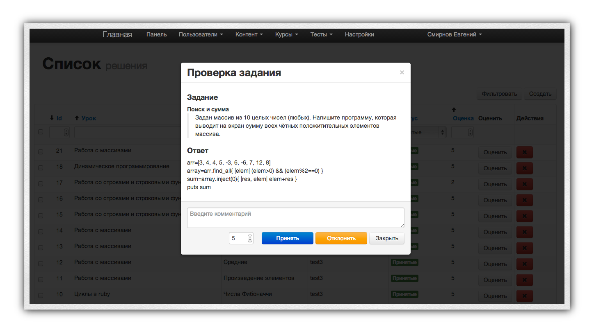

В этом окне есть:

* Текст задания,
* Ответ ученика,
* Поле для ввода вашего комментария,
* Поле для выставления оценки (по умолчанию выставлена оценка 5),
* Кнопки "Принять" и "Отклонить",
* кнопка "Закрыть" для отмены процесса проверки.

Если вы хотите засчитать задание и поставить оценку 4, то последовательность действий следующая:

* Вы пишете комментарий, почему ставите 4, а не 5.
* Меняете оценку с 5 на 4.
* Нажимаете кнопку "Принять".

Отклонение задания аналогично, единственно, оценку в этом случае выставлять не нужно, так как она всё равно не будет учитываться.

### Схема ежедневной проверки

Для ежедневной проверки всех заданий, которые вам отправили ученики, выполните следующие действия:

1. В верхней навигационной панели выбираете "Курсы—>Решения".
2. Рядом с полем "Статус" в выпадающем меню выберите пункт "На проверке" и нажмите справа вверху кнопку фильтровать 
3. Нажмите на кнопку "Оценить" напротив первого решения. Действуйте согласно алгоритму выше в разделе "Процесс проверки задания".
4. После оценки строка пропадёт из таблицы.
5. Перейдите к следующему решению.
6. Повторяйте до тех пор, пока есть непроверенные решения.

> За то время, пока вы выполняете проверку, ученики могут отправить ещё несколько заданий. Нажимайте периодически сверху кнопку "Фильтровать" для обновления результатов поиска.

## Тесты

Тесты представляют собой автоматизированную систему проверки знаний. Тесты состоят из вопросов. Вопросы бывают двух типов:

1. С вариантами ответа.
2. Без вариантов ответа.

Количество потенциальных ответов на вопрос не ограничено. Один вопрос можно прикреплять к нескольким тестам. Иными словами, система позволяет вам составлять тесты нарастающим итогом без необходимости повторного добавления вопросов.

При прохождении теста учеником из базы данных вопросов по данному тесту выбирается несколько и случайным образом показывается ученику. Тем самым, имея базу из, к примеру, 20 вопросов можно создать весьма разные для учеников тесты (при условии, что в одном тесте, к примеру, будет 5 вопросов).

### Список тестов

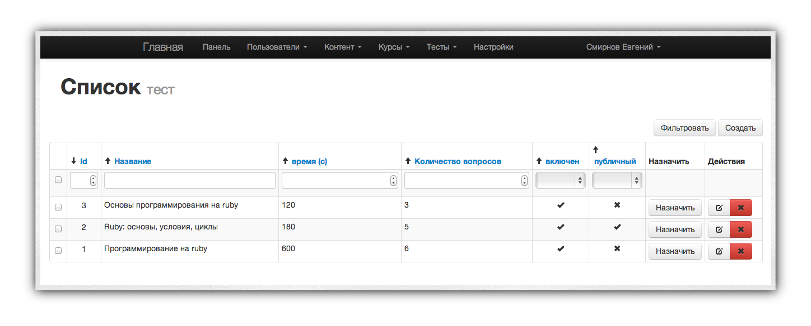

Каждый тест содержит следующие атрибуты:

* название,
* описание,
* время. Если этот параметр равен, к примеру, 300, то тест будет продолжаться 300 секунд = 5 минут. Если этот параметр не указан (пустой), то тест не будет иметь ограничений по времени.
* количество вопросов на ученика. Тест может иметь базу из 100500 вопросов. Никаких ограничений на количество вопросов в одном тесте нет. Параметр "количество вопросов" задаёт то, на сколько вопросов должен ответить ученик, прежде чем тест будет считаться пройденным. Следите за тем, чтобы количество вопросов на ученика не было больше полного количества вопросов в тесте.
* активен (включить / выключить тест),
* открытый. Тест можно сделать открытым, тогда любой ученик сможет его пройти в любое время без необходимости назначать его учителем. Открывайте все тесты, кроме контрольных и проверочных работ.

Процесс создания / редактирования теста, в целом, не имеет особых отличий от ранее рассмотренных примеров.

### Вопросы

Как уже было указано выше, тест состоит из вопросов. У каждого вопроса есть:

* тесты, в которых этот вопрос может появляться;
* текст вопроса;
* тип вопроса (radio: выбор вариантов ответа, text — один вариант ответа);
* количество ответов (число от 1 до бесконечности);
* список ответов;

Ответы — краеугольная составляющая вопроса. Любой вопрос обязан иметь хотя бы один ответ.

Принцип работы ответов очень похож на принцип добавления новых материалов к уроку: та же кнопка "Добавить", те же кнопки "Удалить".

Каждый ответ содержит:

* название (текст) ответа;
* файл (если ответ является картинкой);
* правильно.

О последнем поле следует поговорить отдельно. Оно ведёт себя по-разному для разных типов вопросов. Если ваш вопрос подразумевает текстовый ответ, вводимый учеником, то вам необходимо:

1. Создать **ровно** один ответ (ни больше, ни меньше).
2. Поле "название" у этого ответа оставить пустым.
3. В поле "правильно" для этого ответа вписать правильный ответ (текстом).

Если же ваш вопрос содержит несколько вариантов ответа (тип radio), то вы заполняете поля "название" соответствующими значениями, а в поле "правильно" вписываете либо 0, либо 1. 0 соответствует неправильному ответу, 1 — правильному. Имейте ввиду, что в текущей версии только один ответ может быть правильным.

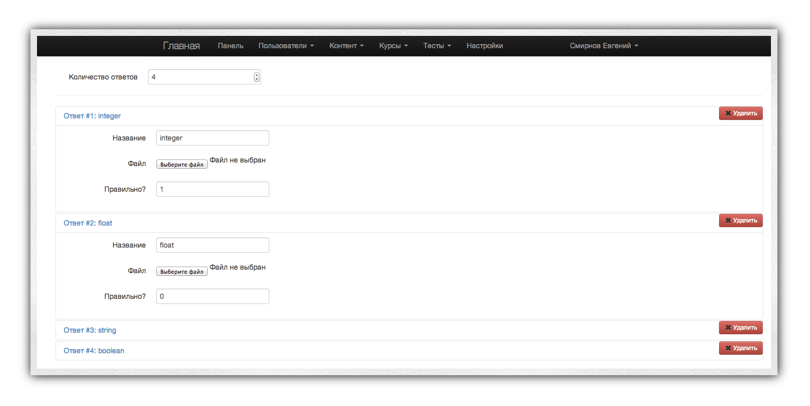

> Не забывайте в конце изменений нажимать кнопку **Сохранить** или **Сохранить и вернуться**. Пока ни одна из этих кнопок не нажата — изменения не применяются.

## Контрольные работы

Функционал контрольных работ построен на уже ранее упоминавшихся тестах. Контрольная работа представляет собой тест, который назначает учитель лично (ученик сам не может его пройти без разрешения) и который проходит одновременно для целой группы учеников. Это позволяет систематизировать получаемые результаты и готовить автоматические отчёты по группам / классам учеников.

### Типы контрольных работ

Для удобства учителя контрольные работы могут быть различных типов. Тип работы — это всего лишь дополнительный параметр классификации. По умолчанию в системе созданы типы "Проверочная работа" и "Контрольная работа". Вы можете добавить / изменить / удалить типы работ в разделе "Тесты->Типы контрольных работ". Процесс абсолютно аналогичен ранее рассмотренным.

### Создание контрольной работы

Для создания контрольной работы необходимо выполнить следующие шаги:

1. Перейти в раздел "Тесты->Контрольные работы".
2. Нажать кнопку "Создать" для создания новой контрольной работы.
3. Заполнить предложенную форму, состоящую из:
    * название (для вашего удобства, чтобы вам было различать различные контрольные работы. Пример удобного названия: "контрольная работа по генетике, 11а").
    * начато (дата начала): когда работа будет проведена. Дата назначается для вашего удобства, на схему работы она не влияет.
    * тип работы: выбирается из списка, созданного заранее (см. раздел "Типы контрольных работ").
    * описание: используется для удобства учителя.
    * тест: на базе какого теста из созданных вами будет построена контрольная работа.
    * статус: в каком статусе работа. Это поле не рекомендуется менять вручную.
4. Нажать кнопку "Создать".

После этих нехитрых действий новая контрольная работа создана. Теперь самое время добавить к ней учеников, которые её будут выполнять:

1. Для этого вернитесь в таблицу со списком контрольных работ. Найдите среди них нужную вам.
2. Напротив этой работы нажмите кнопку "Назначить".
3. Вы попадёте на страницу, где выведена таблица со списком учеников. Внизу таблицы присутствует кнопка "Назначить". Выделите галочками тех учеников, которых вы хотите назначить на эту работу, затем нажмите кнопку "Назначить".

> **Используйте фильтрацию**: если у вас много учеников, найти нужных будет сложно. Используйте фильтрацию по полю "Группы" для того, чтобы отобрать только учеников из нужной вам группы.

После того, как вы назначили учеников для контрольной работы, можно её начинать. Это необязательно делать сразу: вы можете подготовить работу дома, а нажать кнопку "Начать" только на самом уроке. Даже если выбранный содержит ограничение по времени, оно будет применено **только** после того, как вы нажмёте кнопку "Начать". Тем самым вы можете создать любое количество работ заранее, не тратя на это время во время урока.

#### Добавление учеников к контрольной работе

После начала работы ученики начинают её выполнять. Может, однако, случиться так, что к уже начавшейся работе вам нужно добавить других учеников. Это может быть в нескольких ситуациях:

* Например, если у вас — 2 группы учеников, которые должны выполнить эту работу, и если эти группы присутствуют на разных уроках. 
* Или же если у вас не хватает компьютеров, чтобы посадить каждого ученика за отдельную машину.

В этом случае порядок действия следующий:

1. Перейдите в таблицу с контрольными работами.
2. Найдите нужную вам контрольную работу и нажмите напротив неё кнопку "Назначить".
3. Выберите тех учеников, которых вы хотите добавить к уже начавшейся контрольной работе. Не беспокойтесь насчёт дублирования: даже если вы 2-3 раза добавите одного и того же ученика, работу он будет выполнять только одну.
4. Вернитесь в таблицу и напротив выбранной контрольной работы нажмите маленькую кнопку "Добавить". Эта кнопка (вместе с кнопкой "Закрыть") появляется только для начатых контрольных работ. После нажатия этой кнопки выбранные вами в шаге 3 ученики также получат возможность выполнить указанную контрольную работу.

> Обратите внимание: сразу же после нажатия кнопки "Добавить" у выбранных учеников начнёт идти таймер. Нажимайте эту кнопку только тогда, когда ученики готовы проходить тест.

### Завершение контрольной работы

После того, как все учащиеся выполнили контрольную работу, найдите её в таблице и нажмите напротив неё кнопку "Закрыть". После выполнения этого действия можно просмотреть результаты.

### Результаты контрольной работы

Для просмотра результатов контрольной работы нажмите на кнопку "Показать" напротив соответствующей строки таблицы. После этого вы будете переадресованы на страницу результатов. Выводятся следующие данные:

* Список учеников, участвовавших в контрольной работе.
* Название контрольной работы.
* Количество правильных ответов / общее количество заданных вопросов для каждого ученика.
* Процент правильно выполненных заданий.
* Ссылка "Показать ответы".
* Дата прохождения контрольной работы.

Ссылка "Показать ответы" сделана для разбора проверки ответов конкретного ученика. Если ученик не согласен с результатами, учителю доступен функционал сравнения ответов, сделанных учеником, с правильными ответами. Перейдя по ссылке, можно увидеть детальный разбор контрольной работы конкретного ученика.

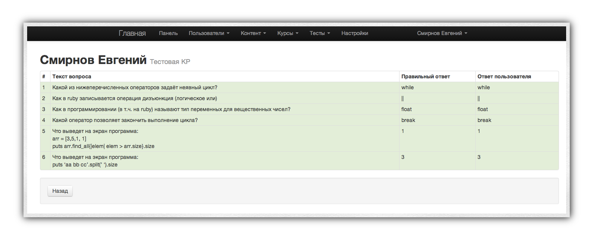

Зелёным цветом выделяются правильные ответы. Разбор содержит:

* порядковый номер вопроса,
* текст вопроса,
* правильный ответ на вопрос,
* ответ, введённый пользователем.

## Заключение

Несмотря на данное руководство, у вас будет множество вопросов. Их большая часть решится сама собой, когда вы попробуете систему в действии. По другим вопросам вы можете обращаться в [официальное сообщество LMS42](https://plus.google.com/communities/115509331188973679018). Успехов при работе с системой!

## Общие рекомендации учителю

* Готовьте большую часть материалов до урока.
* Имейте всегда в запасе хотя бы один урок.
* Проверяйте задания ежедневно. Это занимает не более 5 минут, но существенно повышает обратную связь со стороны учеников.
* Приучайте детей к порядку. К каждому уроку должны быть закрыты все предыдущие.
* Поощряйте учеников, которые добились наилучших результатов.
* Прикрепляйте к каждому уроку тесты. Помните, что один и тот же вопрос может встречаться в скольки угодно тестах. Используйте схему нарастающего итога, заставляя каждый раз повторять уже пройденный материал.

# Ссылки и полезные ресурсы

* [Официальный сайт системы](http://lms42.com)
* [Сообщество Google+ по LMS42](https://plus.google.com/communities/115509331188973679018)
* [Исходный код LMS42](http://github.com/lms42)

